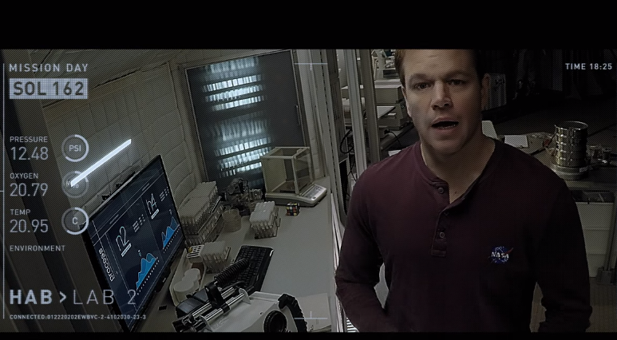

# Archives

Inspired by the movie The Martian, this project emulates the research video logs that astronaut Mark Watney uses to document his progress and daily struggles to survive in Mars.

### Architecture
---
We want to connect a set of webcams based in different locations and timepoints. 

Let C = {Set of cams belonging to a research space location L}. Let T be the timepoint where a log is created. Then, 

log = (CAM id, location, timepoint, video file)

### After Effects
---

After Effects will be used to simulate the UI (time recorded, location of the video, day) shown in the above image.   
